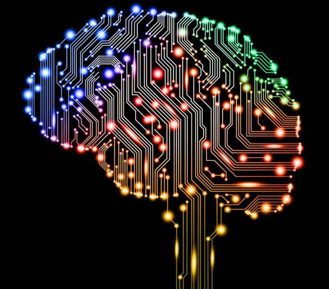

# 20 秒短时记忆法

## 20 秒短时记忆法

今天早上我用了更短的时间记了 30 个单词，过程也更加轻松愉快，方法就是记每个单词的时间不要超过 20 秒，尽量以最短的时间记一遍，节省下来的时间用来记第二遍、第三遍...，我把这种方法称之为 20 秒短时记忆法，这种记忆方法有三个好处：

1. 能很容易的进入“沉浸”式的专注状态；
2. 最高效的利用了大脑；
3. 短时多次记忆更符合人的记忆规律。

先来说说第一点，不知道你们有没有这样的体验，状态好的时候，很多单词看一遍就能记住，状态差的时候，一个单词来来回回记了几次，依然记不住，那么何为状态好？如何才能保持好的状态？

以前一直感到自己的学习状态不受自己控制，直到前段时间读《暗时间》，书中提到做事要专注，专注度越高，做事的效率就越高，如果将人脑比作 CPU, 专注度就像当于 CPU 的使用率，CPU 使用率 20%和 100%，显然后者运算效率更高，人在学习的时候，会因为大脑没有高速运转，或是分心在其它次要的事情上，导致学习效率不高。理解这一点不难，难的是如何保持更高的专注度，想想自己在什么情况下专注度高？ 比如做感兴趣的事，或者遇到危险的时候，或者在有一定紧迫感的情况下，我上学时很难专心做题，考试时却不知不觉做完一大张试卷，原因就是因为考试时有一种紧迫感，20 秒记忆法也是通过给大脑施加压力来快速进入专注状态，因为要求大脑在短时间内记住一个单词，时间在一秒一秒减少，人会有紧迫感，然后就会进入专注状态。

为什么要以最短时间去记忆，而不是花更长的时间以求达到更长久的记忆效果？ 短时记忆的另一个好处就是最高效的利用大脑，假定我们记住一个单词需要 20 秒，当我们花 20 秒记住一个单词的时候（不包括拼写），往往会想再花 60 秒反复记忆这个单词，以求记的更牢固，但后面这 40 秒其实属于低效率的事情，就像你已经知道 1+1=2 了，让你再花一天时间去记 1+1=2 有意义吗？ 最初记这个单词的 20 秒效率最高，根据边际递减效应，后面的 40 秒效率会越来越低，不如把这 60 秒花费在记新的单词上面，这样你以短时间记住一组单词 ，省下来的时间花费在复习第二遍上面，这时正好是第一遍的单词将要遗忘的时候，通过复习第二遍达到更长久的记忆效果，这也符合诺宾浩斯记忆抗遗忘规律。

按照这种方法，大脑在一段时间内：

1. 保持着较高的专注度；
2. 较高的利用率；
3. 反复复习。

如此一来，记单词的效率自然会提高，复习单词的时候，也用同样的方法，每个单词只看 3 秒，或者更少的时间，原来用 10 分钟复习一遍，现在可以复习三遍，复习效率自然也会提高。

## Keywords

`记单词` `抗遗忘` `短时记忆`

<!-- author alvin -->
<!-- email alvinhtml@gmail.com -->
<!-- createAt 2017-01-06 12:51:00 -->
<!-- updateAt 2017-01-06 12:51:00 -->
