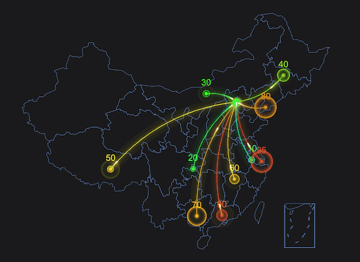
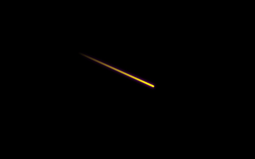
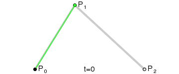
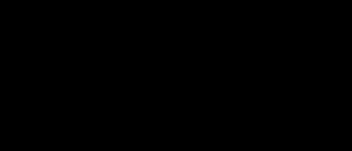

# 使用 Canvas 绘制光线飞过效果

经常在一些 Canvas 特效中看到光线飞过的效果，像流星一样拖着长长的尾迹，有时候光线还会沿着曲线运动，如下图的地图中，这种效果是如何实现的呢？今天我们来试着在 Canvas 中实现这种效果。



在开始之前，我们先在 html 中创建 Canvas 画布：

```html
<html lang="en">
  <head>
    <title>canvas 飞线</title>
    <style>
      body {
        margin: 0;
        padding: 0;
        background: #000000;
      }

      canvas {
        position: absolute;
        top: 0;
        left: 0;
        width: 100%;
        height: 100%;
      }
    </style>
  </head>

  <body>
    <canvas id="mycanvas"></canvas>
    <script type="text/javascript">
      const mycanvas = document.getElementById("mycanvas");
      const context = mycanvas.getContext("2d");

      const canvasWidth = window.innerWidth;
      const canvasHeight = window.innerHeight;

      mycanvas.width = canvasWidth;
      mycanvas.height = canvasHeight;
    </script>
  </body>
</html>
```

创建 canvas 画布，宽高分别等于屏幕的宽高，为了方便，在之后的内容中，我会略去这部分代码。

## 绘制光线尾迹



尾迹是光线运动过程中留下的残影，是一个由亮到暗，由粗到细的过程，实际上可以近似的看成逐渐变为透明的一条线，这样可以很容易的用线性渐变实现。

```js
// 创建渐变
function createGradient(context, p0, p1) {
  const gradient = context.createLinearGradient(p0.x, p0.y, p1.x, p1.y);

  gradient.addColorStop(0, "rgba(255, 0, 255, 0)");
  gradient.addColorStop(1, "rgba(255, 0, 255, 1)");

  return gradient;
}
```

`p0` 和 `p1` 分别为线段的开始点和结束点，我们使用 `moveTo` 和 `lineTo` 绘制直线，并使用已创建好的渐变色来填充直线的路径，需要注意的是，这里的路径不需要闭合。

```js
// 绘制线条
function createLine(p0, p1) {
  const gradient = createGradient(context, p0, p1);

  context.beginPath();
  context.moveTo(p0.x, p0.y);
  context.lineTo(p1.x, p1.y);
  context.strokeStyle = gradient;
  context.lineCap = "round";
  context.lineWidth = 3;
  context.shadowColor = "rgba(255, 0, 255, 1)";
  context.shadowBlur = 5;
  context.stroke();
}
```

## 实现飞线动画

飞线的运动需要沿着一个方向，我们只需要定义开始点 P0 和结束点 P1 就能确定飞线的运动方向和路径。

```js
const P0 = {
  x: 100,
  y: 100,
};

const P1 = {
  x: 600,
  y: 300,
};
```

我们先假设一个点 p1 在这条直线上运动，p1 随 t 的变化而变化，t 可以是 0 到 1 之间的任意值，给出 t 的值，也就可以求出 p1 的值，公式如下：

```
x = P0.x + (P1.x - P0.x) * t
y = p0.y + (P1.y - P0.y) * t
```

利用上面的公式创建一个给出任意 t 值，求对应点坐标的函数：

```js
function computeLinePoint(p0, p1, t) {
  return {
    x: p0.x + (p1.x - p0.x) * t,
    y: p0.y + (p1.y - p0.y) * t,
  };
}
```

因飞线沿着这条直线运动，飞线的起始点和结束点都在这条直线上，我们只需要求出两个点，并将这两个点连结起来，就是飞线。

我们定义两个 t 值，t0 和 t1，分别用来计算飞线的起始点和结束点。为了让飞线有一个从无到有的过程，我们让 `t1 > 0.3` 以后，t0 的值才开始变化，同样的，在结束的时候，我们要实现飞线从有到无的动画过程，所以需要在 `t0 > 0.7` 以后，t1 的值等于 1，直到当 t0、t1 在下一次 `+= 0.005` 后都大于 1，重置 t0、t1 的值，动画重新开始。

按照上面的思路创建一个绘制动画的函数：

```js
let t0 = 0; // 飞线起始点的 t 值
let t1 = 0; // 飞线结束点的 t 值

function draw() {
  context.clearRect(0, 0, canvasWidth, canvasHeight);

  if (t1 < 0.3) {
    t0 = 0;
  }

  if (t0 > 0.7) {
    t1 = 1;
  }

  const startPoint = computeLinePoint(P0, P1, t0);
  const endPoint = computeLinePoint(P0, P1, t1);

  context.save();
  createLine(startPoint, endPoint);
  context.restore();
  t0 += 0.005;
  t1 += 0.005;
  if (t0 > 1 && t1 > 1) {
    t0 = 0;
    t1 = 0;
  }

  requestAnimationFrame(draw);
}

draw();
```

到此一个直线飞线效果就实现了，[点击查看演示效果](http://example.alvinhtml.com/canvas/fly-line.html)。

## 绘制二次贝塞尔曲线

如何让飞线沿着曲线运动呢，在 canvas 中，绘制曲线的函数主要有两种， 分别是绘制二次贝塞尔曲线的函数 `quadraticCurveTo()` 和绘制三次贝塞尔曲线的函数 `bezierCurveTo()`，因为我们要画的是抛物线，所以使用二次贝塞尔曲线。

### 什么是贝塞尔曲线？

贝塞尔曲线（Bezier curve）是计算机图形学中相当重要的参数曲线，贝塞尔曲线于 1962 年，由法国工程师皮埃尔·贝塞尔（Pierre Bézier）所发表，他第一个研究了这种矢量绘制曲线的方法，并运用贝塞尔曲线来为汽车的主体进行设计。

贝塞尔曲线（Bezier curve）通过一个方程来描述一条曲线，根据方程的最高阶数，又分为线性贝赛尔曲线，二次贝塞尔曲线、三次贝塞尔曲线和更高阶的贝塞尔曲线。

贝塞尔曲线的定义：起始点、终止点（也称锚点）、控制点。通过调整控制点，贝塞尔曲线的形状会发生变化。



### 二次贝塞尔曲线方程

二次贝塞尔曲线包括了起始点 P0，终止点 P2，和一个控制点 P1。二次贝塞尔曲线的表达方程如下：

```
B(t) = (1-t) * (1-t) * P0 + 2 * t * (1-t) * P1 + t * t * P2
其中： t ∈[0,1]
```

上面的公式可以转化成如下函数

```js
/*!
 * 计算二次贝塞尔曲线上的点
 * @param {Number} p0 起始点
 * @param {Number} p1 控制点
 * @param {Number} p2 结束点
 * @param {Number} t 当前 t 值， 0 <= t <= 1
 * @return {Number} 返回计算后的点
 */
function computeCurvePoint(p0, p1, p2, t) {
  return (1 - t) * (1 - t) * p0 + 2 * t * (1 - t) * p1 + t * t * p2;
}
```

利用这个方程，给出任意 t 值，我们都可以求出曲线上对应点的坐标，让我们先定义三个点，起始点 P0，终止点 P2，和一个控制点 P1。

```js
const P0 = {
  x: 100,
  y: canvasHeight / 2,
};

const P1 = {
  x: canvasWidth / 2,
  y: canvasHeight / 2 - 200,
};

const P2 = {
  x: canvasWidth - 100,
  y: canvasHeight / 2,
};
```

对于给出任意 t 值，曲线对应点的坐标为：

```js
const currentPoint = {
  x: computeCurvePoint(P0.x, P1.x, P2.x, t),
  y: computeCurvePoint(P0.y, P1.y, P2.y, t),
};
```

### 绘制曲线的片段

沿曲线运动的飞线，其实就是曲线的某一片段，只不过飞线的坐标随 t 的变化而变化，现在我们已经可以求出曲线上点的坐标的集合，只需要把其中某一部分点用 `lineTo()` 连结起来，就近似的得出了曲线的片段。

```js
// 绘制曲线
function createCurveLine(points) {
  const gradient = createGradient(
    context,
    points[0],
    points[points.length - 1]
  );

  context.beginPath();
  context.moveTo(points[0].x, points[0].y);

  // 参数 points 是曲线上一部分连续点的集合，我们用 lineTo 把这些点连结起来，就近似的得到了曲线
  for (let i = 0; i < points.length; i++) {
    const p = points[i];
    context.lineTo(p.x, p.y);
  }

  context.moveTo(points[0].x, points[0].y);
  context.strokeStyle = gradient;
  context.lineCap = "round";
  context.lineWidth = 3;
  context.shadowColor = "rgba(255, 255, 0, 1)";
  context.shadowBlur = 5;
  context.stroke();
}
```

### 绘制沿曲线运动的飞线

同样的，按照上面的思路创建一个函数，实现沿曲线运动的飞线效果：

```js
let t0 = 0;
let t1 = 0;
let points = []; // 存储曲线上点的集合
const lineLength = 0.3;

function draw() {
  context.clearRect(0, 0, canvasWidth, canvasHeight);

  if (t1 < lineLength) {
    t0 = 0;
  }

  if (t0 > 1 - lineLength) {
    t1 = 1;
  }

  const currentPoint = {
    x: computeCurvePoint(P0.x, P1.x, P2.x, t1),
    y: computeCurvePoint(P0.y, P1.y, P2.y, t1),
  };

  // 每当 t1 变化时，就将对应的点添加到 points 集合中
  points.push(currentPoint);

  const len = points.length;

  context.save();
  if (len > 1) {
    createCurveLine(
      points.slice(Math.floor(len * t0), Math.max(Math.ceil(len * t1), 2))
    );
  }
  context.restore();
  t0 += 0.005;
  t1 += 0.005;

  if (t0 > 1 && t1 > 1) {
    t0 = 0;
    t1 = 0;
    points = [];
  }

  requestAnimationFrame(draw);
}

draw();
```

使用 `points.slice` 截取集合的一部分，lineLength 的值决定了这部分的大小，最终效果如下图：



完整的代码，你可以[在这里查看](https://github.com/alvinhtml/html/blob/master/src/canvas/fly-curve-line.html)，也可以[点击这里查看演示效果](http://example.alvinhtml.com/canvas/fly-curve-line.html)。

## 结束语

为了便于理解，我没有编写更复杂的代码去优化性能，所以上面的代码有很大的优化空间，由于显示器的分辨率是有限的，曲线上点的集合 points 的密度和曲线的平滑度之间，需要找到一个最佳平衡点，而且 points 也可以缓存起来，不用每次都清空。

利用贝塞尔曲线，还可以为动画添加缓动，我们在写 CSS 动画时用到的 `ease`, `ease-in-out` 等就是利用贝塞尔曲线公式求得，有兴趣的话，可以自行了解。

## 参考

- [深入理解贝塞尔曲线](https://xiaozhuanlan.com/topic/9506147283)

## Keywords

`canvas` `飞线` `流星` `光线飞过` `贝塞尔曲线`

<!-- author alvin -->
<!-- email alvinhtml@gmail.com -->
<!-- createAt 2022-01-10 20:03:00 -->
<!-- updateAt 2022-01-11 22:00:00 -->
