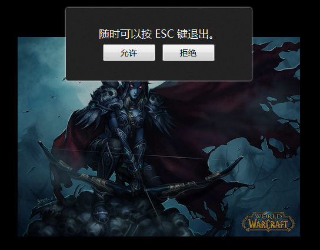

## HTML5全屏API：requestFullscreen 和 exitFullscreen

FullScreen API 是一个新的 JavaScript API,让 HTML 元素可以实现全屏显示，调用时浏览器会弹出一个全屏显示的请求，得到用户的允许后，即可全屏显示，交互完成后随时可以退出全屏状态。接下来和大家分享下 FullScreen API 的前端调用方法。



## 启动和退出全屏

FullScreen API 目前仍是草案，支持的浏览器有：Chrome 15 / Firefox Nightly / Safari 5.1 / IE 11。 各个浏览器调用方法不一样。

对于 Webkit 内核的浏览器，可以运行以下代码就能让整个页面全屏显示：

```js
document.body.webkitRequestFullScreen();
```

除了能让整个页面全屏，还可以让某一个元素全屏显示：

```js
document.getElementById("div").webkitRequestFullScreen();
```

需要退出全屏时运行以下代码：

```js
document.webkitCancelFullScreen();
```

这里需要注意的是，退出全屏只能通过 document 对象调用，而不是使用普通的 DOM element.

各个浏览器的API方法有所不同，主要是前缀不同，用法一样。
```js
// Webkit (Safari5.1 和 Chrome 15)
element.webkitRequestFullScreen();
document.webkitCancelFullScreen();

// Firefox 10
element.mozRequestFullScreen();
document.mozCancelFullScreen();

// IE 11
element.msRequestFullscreen();
document.msExitFullscreen();

// W3C 提议
element.requestFullscreen();
document.exitFullscreen();
```

以下是封装了一个兼容函数

```js
// 参数为需要全屏的 element 对象  
function launchFullScreen(element) {  
  if(element.requestFullscreen) {  
    element.requestFullscreen();  
  } else if(element.mozRequestFullScreen) {  
    element.mozRequestFullScreen();  
  } else if(element.webkitRequestFullscreen) {  
    element.webkitRequestFullscreen();  
  } else if(element.msRequestFullscreen) {  
    element.msRequestFullscreen();  
  }  
}

// 整个页面调用  
launchFullScreen(document.documentElement);  

// 单个元素调  
launchFullScreen(document.getElementById("video"));
```

退出全屏

```js
function exitFullscreen() {  
  if(document.exitFullscreen) {  
    document.exitFullscreen();  
  } else if(document.mozCancelFullScreen) {  
    document.mozCancelFullScreen();  
  } else if(document.webkitCancelFullScreen) {  
    document.webkitCancelFullScreen();  
  } else if(document.msExitFullscreen){
    document.msExitFullscreen();
  }
}
```

## 检查全屏状态变化

当浏览器全屏状态发生改变时，会触发 fullscreenchange 事件，各浏览器写法有所不同，如下：

```js
document.addEventListener("fullscreenchange", function () {  
    alert(document.fullscreen);
}, false);  

document.addEventListener("mozfullscreenchange", function () {
    alert(document.mozFullScreen);
}, false);  

document.addEventListener("webkitfullscreenchange", function () {
    alert(document.webkitIsFullScreen);
}, false);
```

## 键盘输入事件

为了安全原因，很多情况下全屏输入都是被阻塞禁止的，但是chrome允许通过下面的API来允许键盘输入

```js
docElm.webkitRequestFullScreen(Element.ALLOW_KEYBOARD_INPUT);
```

## Keywords

`全屏` `requestFullscreen` `exitFullscreen`
