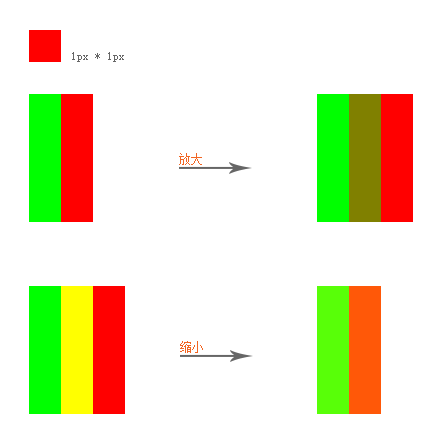
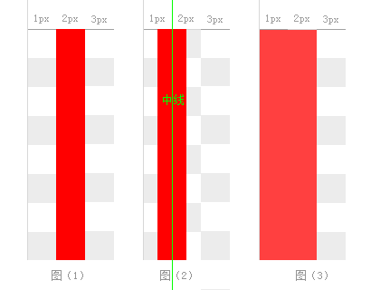

# Canvas画图模糊问题及解决方法

使用canvas画图时经常遇到画出来的图形模糊、边框不清晰等现象，曾经为了解决这些问题走了很多弯路，浪费了大把时间，当然也积累了一些经验，今天就把这些问题总结出来。

一般图像模糊的主要有两个原因:

- 图像被放大或缩小
- 图像处于半个像素的位置

因为canvas是点阵图，由一个个像素组成，当图像被放大时，一个像素会被强形拉伸至一个以上，多出来的像素均匀的分部在图像中，计算机为了使拉伸后的图像看起来平滑，会给这些多出来的像素计算出一个过渡色，缩小图像时，多个像素合成一个像素，计算机会用这多个像素的色彩值计算出一个过渡色来填充这个像素，不管是放大还是缩小，都会造成图像原有像素信息丢失。



注意，拉伸或缩小后的色值已经和原有不一样了。

另一种造成图像模糊的原因是一个像素点出现在两个像素位置的中间，也就是各占半个像素的情况。因为画布最小单位是一个像素，小于1像素的东西可能显示不出来，但计算机可不管，他会试着画一下，计算机会自动将半个像素画成一个像素，并填充一个计算出的过渡色。

## 在canvas中如何避免模糊

在canvas中想要避免图像出现模糊现象，有几点需要注意。

1、 canvas的宽高和CSS样式中的宽高不一致会导至图像模糊

在canvas中，canvas.width和canvas.style.width是两个不同的值。

canvas就像一张图片，canvas.width是画布的宽，就像当于图片的实际宽，canvas.style.width则是canvas样式的宽，就像当于给图片设置CSS样式改变宽一样，浏览器会把画布的宽缩放到canvas.style.width规定的宽，当canvas.width与canvas.style.width不一致，就会导至画布被缩放，同理，canvas.style.height也一样。

如查不想让canvas缩放，画布的宽高应该和样式中的宽高设为一样的值：

```html
<canvas width="800" height="600" style="width:800px;height:600px;"></canvas>
```

需要注意的是，`style="width:100px"` 或者 `canvas {width:100px;}` 这两个样式实际是改变了 `canvas.style.width` 的值。

2、 边框为奇数时画出来的线条会模糊



在canvas中，每条线都有一条无限细的“中线”，线条的宽度是从中线向两侧延伸的。如果我们从第2个像素点画一条线，那么线条的中线就会靠齐到第2个像素的起点，然后我们开始画了，问题也就来了：Canvas 的线条以中线向两侧延伸，而不是向某一边延伸(如图2)，这时，计算机就遇到了小于1像素这个问题，他采取了个折中的画法，把这两个像素都画了

所以，如此一来，本来1px的线条，就变成了看起来2px宽的线条。问题的原因找到了，Canvas中的line把中线与像素的起点对齐了，而不是像素的中间点。

那么我们怎么解决这个问题呢？聪明的你可能已经想到：既然是因为line的中线没有与像素的中间点对齐，那我们就把他们对齐吧！

像素的中间点很好找，比如第2像素的中间点，依据图上的解释就是 1.5 像素的位置，那么x像素的中间点就是 (x-0.5)px

```js
context.lineWidth = 1
context.beginPath()
context.moveTo(1.5,100)
context.lineTo(1.5,130)
context.closePath()
context.stroke()
```

3、 宽高或坐标出现半个像素时画出来的图像会模糊

这个画出来模糊的原因也是半个像素造成的，所以在使用canvas画图时，应该尽量避免宽高出现半个像素的情况，除画边框外，坐标也不要出现半个像素的情况。

在用canvas的API画图时使用 Math.ceil() 或 Math.floor() 将可能出现的浮点数转为整数。

```js
context.fillRect(Math.floor(x),Math.floor(y),Math.floor(width),Math.floor(height))
```

需要注意的是，使用canvas translate()方法重新映射画布上的 (0,0) 位置时，如果传入的参数不是整数，也会导致图像变模糊。解决方法和上面一样：

```js
context.translate(Math.floor(x),Math.floor(y))
```

关于Canvas画图模糊问题，我暂时只发现了这些，如果你还知道其它可能，欢迎留言补充。

## Keywords

`canvas` `模糊`

<!-- author alvin -->
<!-- email alvinhtml@gmail.com -->
<!-- createAt 2016-05-18 22:03:00 -->
<!-- updateAt 2016-05-18 20:00:00 -->
